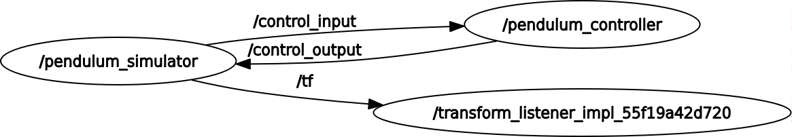
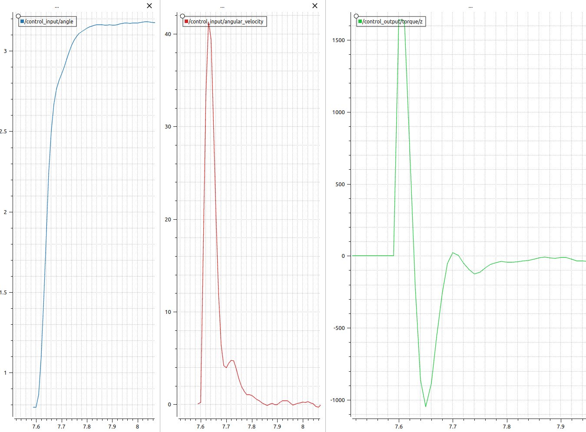

# Pendulum Control with ROS2

This project implements a pendulum control system using ROS2. The system simulates a pendulum and applies control techniques to maintain the pendulum at an upright position. 

## Setup and Installation

1. Install ROS2 Humble by following the instructions [here](https://docs.ros.org/en/humble/Installation/Ubuntu-Install-Debians.html).

2. Create a new ROS2 workspace or navigate to your existing workspace:
```
mkdir -p ~/ros2_ws/src
cd ~/ros2_ws/src
```
3. Clone the pendulum control project into your workspace's `src` directory.

4. Source your ROS2 workspace:
```
source ~/ros2_ws/install/setup.bash
```
5. Build the project using colcon:
```
cd ~/ros2_ws
colcon build --packages-select pendulum_control
```

## Running the Project

Notes:
Make sure in every new terminal source the ROS2 workspace before running these commands. Also make sure there is no virtual environment running on the terminal  (if so, deactivate it first).

First, start the pendulum controller:
```
ros2 run pendulum_control controller_node --ros-args --params-file pendulum_control/config/pendulum_parameters.yaml
```
Then, in another terminal, start RViz2:
```
ros2 run rviz2 rviz2
```
Finally, in a third terminal, start the pendulum simulator:
```
ros2 run pendulum_control pendulum_simulator --ros-args --params-file pendulum_control/config/pendulum_parameters.yaml
```

## Project Structure

The project structure is as follows:

- `config`: This folder contains the YAML file for setting parameters like mass, gravity, length, integrator type, and control mode for the pendulum simulator, and the gain values for the controller.
- `src`: This folder contains the source files for the pendulum simulator and controller nodes.
- `msg`: This folder contains custom message `PendulumState.msg` which is used to communicate between the simulator and the controller
- `include`: This folder includes all the header-only libraries (empty)!

## Node and topics graphs



## Configuration

The configuration of the pendulum simulator and controller is done through a YAML file. This provides an easy way to tune parameters without changing the source code.

### Pendulum Simulator Configuration

The pendulum simulator's configuration includes parameters such as mass (`m`), gravity (`g`), length (`L`), integrator type (`integrator`), and simulation mode (`sim_mode`).

- `m`: The mass of the pendulum.
- `g`: The acceleration due to gravity.
- `L`: The length of the pendulum.
- `integrator`: The type of numerical integration to use for the simulation. Choices are "Euler" for Euler's method, or "RK4" for the 4th order Runge-Kutta method.
- `sim_mode`: The simulation mode. "free-fall" for uncontrolled simulation where the pendulum is free to swing, "controlled" where the pendulum controller is active and "perturb" where there is active control but perturbation is added to torque input.

Example configuration:

```yaml
pendulum_simulator:
    ros__parameters:
        m: 1.0
        g: 9.81
        L: 1.0
        integrator: "RK4"
        sim_mode: "controlled"
```

### Pendulum Controller Configuration

The pendulum controller's configuration includes parameters such as `K_theta` and `K_omega`, which are the gain values for the LQR controller.

- `K_theta`: The gain for the pendulum angle error.
- `K_omega`: The gain for the angular velocity error.

Example configuration:

```yaml
pendulum_controller:
    ros__parameters:
        K_theta: 30.0
        K_omega: 30.0
```

These parameters are loaded at startup from the specified YAML file using the `--params-file` argument. They can be adjusted as needed to change the behavior of the pendulum simulator and controller.

## Pendulum Equations of Motion
The equations of motion for a simple pendulum under the influence of gravity are derived from Newton's second law of motion. The system consists of a mass (m) connected to a fixed pivot point by a rod of length (L). The pendulum can swing in a plane under the influence of gravity (g).
The angle that the pendulum makes with the vertical direction is denoted as θ. Positive θ corresponds to counterclockwise rotation from the vertical. We assume that the pendulum rod is massless and that all the mass is concentrated at the end of the rod.
The equation of motion is:
```math
\begin{aligned}
\tau = I \alpha\\
- m \cdot g \cdot sin(\theta) L = m L^2 \frac{d\theta^2}{dt^2} \\
\frac{d\theta^2}{dt^2} = -\frac{g}{L} \cdot sin(\theta)
\end{aligned}
```
This second order differential equation is nonlinear due to the sine function. However, for small angles, sin(θ) can be approximated to θ, simplifying the equation to:
```math
\frac{d^2\theta}{dt^2} = -\frac{g}{L} \cdot \theta
```
This is a simple harmonic motion equation.
The pendulum's angular velocity ($\omega = \frac{d\theta}{dt}$) and angular acceleration ($\alpha = \frac{d^2\theta}{dt^2}$) can be updated over time using numerical integration methods such as Euler's method or the 4th order Runge-Kutta method, depending on the `integrator` parameter.

When the pendulum is being controlled, an additional torque term can be introduced to the equation of motion to simulate a controlled pendulum. The controlled equation of motion is:

```math
\frac{d\theta^2}{dt^2} = - \frac{g}{L} \cdot sin(\theta) + \frac{\tau}{m \cdot L^2}
```

where $\tau$ is the control torque applied at the pivot point.

## State-Space Equations
We linearize the plant to get the state-space form so we can design a linearized controller.

```math
\dot{x} = A \cdot x + B \cdot \tau
```
where x is the state vector:
```math
\begin{equation}
x = \begin{bmatrix} 
\omega \\
\theta
\end{bmatrix}
\end{equation}
```
And

```math
\begin{aligned}
A = \begin{pmatrix}
0 & -\frac{g}{L}\\
1 & 0
\end{pmatrix}\\
B =  \begin{bmatrix}
\frac{1}{m \cdot L^2}\\
0
\end{bmatrix}
\end{aligned}
```

## Control: Linear Quadratic Regulator (LQR)
The control strategy used in this project is based on the Linear Quadratic Regulator (LQR) approach. LQR is a type of optimal control algorithm that aims to minimize a quadratic cost function of the state and control input. In a simple control problem, the LQR cost function could be written as follows:

```math
J = \int (x^TQx + u^TRu) dt
```

Where:
- $x$ is the state vector
- $u$ is the control input vector
- $Q$ and $R$ are the weight matrices for the states and control inputs, respectively

By adjusting the elements in $Q$ and $R$, we can tune the performance of our controller. The values chosen for this project are $Q = [1, 500.0]$ and $R = [0.001]$ ($Q(1,1)$ is related to how much we penalize the $omega$ error and $Q(2,2)$ is how much we penalize the error on the $\theta$. R is how much we penalize actuator effort ($\tau$)). These values are empirical and are chosen to achieve good pendulum balancing performance in the simulator.

LQR operates by solving the Algebraic Riccati Equation (ARE) and obtaining a state feedback law.

### Algebraic Riccati Equation (ARE)

The ARE is a type of quadratic equation that arises in the LQR control design. Given a continuous-time linear time-invariant system represented by the state-space model $x' = Ax + Bu$, the ARE takes the form:

```math
PA + A^TP - PBR^{-1}B^TP + Q = 0
```

Where $P$ is the solution to the ARE. Once the ARE is solved for $P$, the optimal feedback gain $K$ is given by $K = R^{-1}B^TP$. This gain matrix $K$ is then used in the control law $u = -Kx$.

There are several numerical methods to solve the ARE, such as the Schur method, the Newton method, and the eigenvalue method. Some software packages, like MATLAB, offer built-in functions to solve the ARE. It's not necessary to solve the ARE by hand or write your own solver for the ARE. Control libraries and software (like MATLAB's Control System Toolbox or Python's control library) provide functions to solve the ARE and compute the LQR gains.

It's important to note that the ARE only has a unique positive semi-definite solution if certain conditions on the matrices $A$, $B$, $Q$, and $R$ are met, such as $A$ being stable, $Q$ being positive semi-definite, and $R$ being positive definite. These conditions ensure that the optimal control problem posed by the LQR formulation is well-posed and has a solution.

## Results
$K_{\theta}$ = 697.3648
$K_{\omega}$ = 48.9360
integrator: RK4
controller output time period: 10ms
### Free-fall case (No controller):

[](https://youtu.be/N4ZwnxJj3JI)

### Controlled case:

[https://github.com/earasteh/inverted_pendulum_Cpp/assets/33266143/728afa6e-0006-4f37-a584-eb8e55c9ee53
](https://youtu.be/_-tOt52oRbw)

### Purterbed case:
[[perturb.webm](https://github.com/earasteh/inverted_pendulum_Cpp/assets/33266143/728610c8-6ef5-4bb3-9d98-f256c231cb95)
](https://youtu.be/vbbbI5J1vL0)
And here are the plots of $\theta$ (rad), $\omega$ (rad/sec) , and $\tau$ (N.m).




